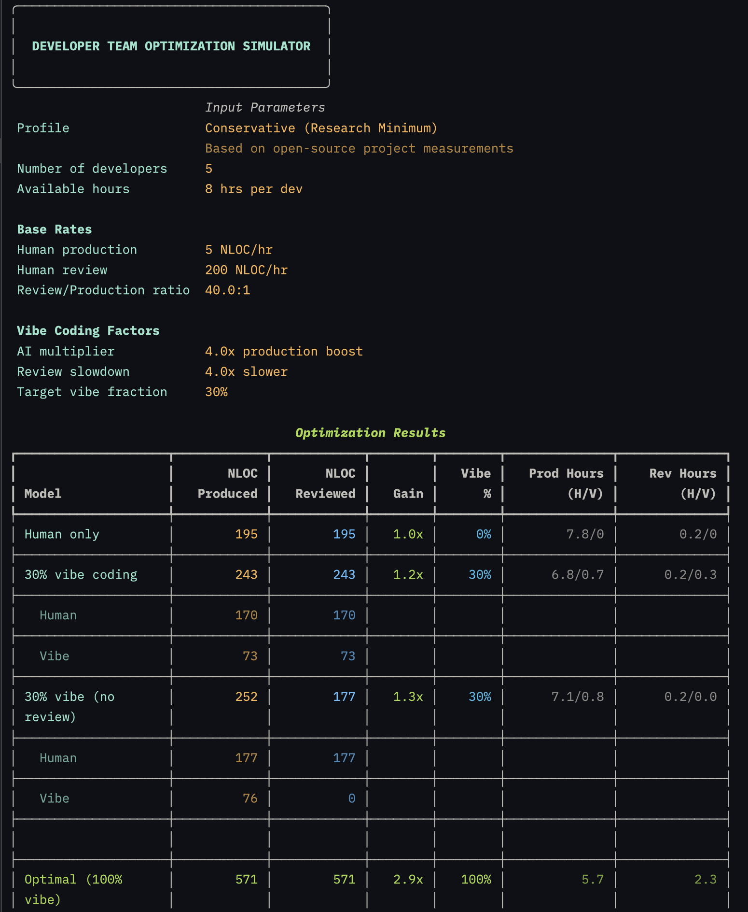

# quant-vibe
Quantify the effects of human-machine collaborative software development (vibe coding).

## [team-vibe-simul](./team-vibe-simul)

## [Survey of AI Coding Studies 2020-2025](https://htmlpreview.github.io/?https://github.com/jadnohra/quant-vibe/blob/main/docs/Cheatsheet%20-%20Survey%20of%20AI%20Coding%20Studies%202020-2025.html)

